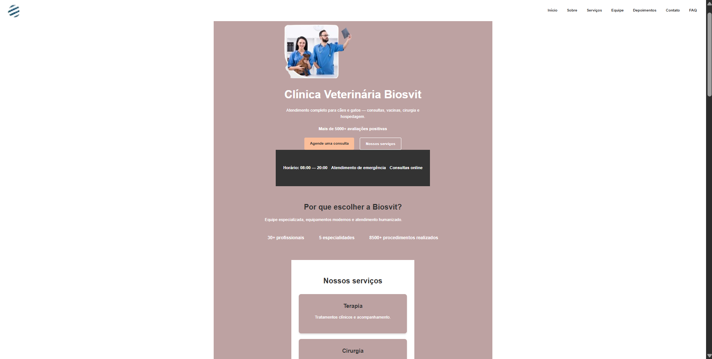

# 🐾 PetShop - Seu amigo de quatro patas merece o melhor!

## 📖 Sobre o projeto

Bem-vindo ao **PetShop**! 🐶🐱🐰
Este é um site desenvolvido com **HTML + CSS** para apresentar uma clínica/loja pet de forma moderna, fofa e funcional ✨.
Aqui, você encontra informações sobre-nos, os serviços, equipe, contatos e localização e até depoimentos dos clientes! ❤️

---

## 🚀 Tecnologias utilizadas

* 🖥️ **HTML5** → estrutura do site
* 🎨 **CSS3** → estilos e layout
* 🖼️ **Imagens** → porque todo pet é fotogênico 🐕📸

---

## 📂 Estrutura do projeto

```
📦 Trabalho-petshop-main
 ┣ 📜 index.html   → página principal
 ┣ 🎨 style.css    → estilos do site
 ┣ 🖼️ img/depoimento.jpg
           ivan.jpg
           logo.png
           mapa.jpg
           profissionais.png
           team.png         → imagens usadas no projeto
```

---

## 🎯 Funcionalidades

✅ Página inicial apresentando os serviços do PetShop, os botões de agendamento e nossos serviços
✅ Sobre que explicar o porque escolher a biosvit
✅ Serviços mostra os nosso serviços
✅ Sessão com equipe e profissionais 👩‍⚕️👨‍⚕️
✅ Depoimentos de clientes satisfeitos 🐾
✅ Formulário para o cliente preencher seus dados para uma consulta
✅ Contatos e Localização para facilitar a visita ao petshop 🗺️

---

## 💻 Como visualizar

1. Baixe ou clone este repositório:

   ```bash
   git clone https://github.com/usuario/Trabalho-petshop-main.git
   ```
2. Abra o arquivo `index.html` no navegador 🌐
3. Aproveite a experiência e compartilhe com os pets 🐕🐈

---

## 📸 Prévia do projeto e Inspiração(figma)

👉 "(https://www.figma.com/design/oY49tcyArmhEIa2zwOThLI/Landing-page-Veterinary--Community-?node-id=0-1&p=f&t=nh63MaDf5bOf8kEF-0)"
 

---

## 👩‍💻 Autor

[@joaocanabico69](https://github.com/joaocanabico69)
[@302781MaVi](https://github.com/302781)
[@Luscas54](https://github.com/LUSCAS54)
---
Feito com muito carinho 💙 para os pets e seus donos 🐾
